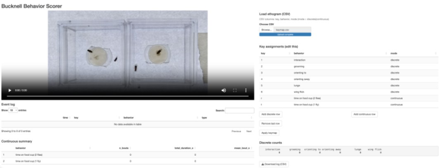

## Background

behaviorScoreR is a keyboard-driven video scoring tool for animal behavior. A manual scorer watches pre-recorded animal behavior videos and presses assigned keys to log specific behaviors with timestamps.

The app supports two behavior types:

1. Discrete behaviors
2. Continuous behaviors

Discrete behaviors are brief events that occur at specific moments in time. Each occurrence is recorded by pressing the assigned key once.

Examples:

- Lunge
- Retreat
- Wing threat
- Jump

Continuous behaviors are behavioral states with measurable duration. The assigned key is pressed once to start the behavior and pressed again to end the behavior.

Examples:

- Grooming
- Chasing
- Courtship
- Feeding

behaviorScoreR produces:

- A timestamped event log
- Running counts for discrete behaviors
- Continuous behavior summaries
- Downloadable CSV files for analysis

## Part 1: App Setup

Get behaviorScoreR from the [Bucknell-Behavior-Scorer repository](https://github.com/Pueblo-Brain-Science/Bucknell-Behavior-Scorer). Click the green **Code → Download ZIP** button and unzip it or clone the repository via git.

After getting the behaviorScoreR, the folder structure should appear as follows:

```text
Bucknell Behavior Scorer/
├── app.R
├── run.R                              # terminal launcher
├── assets/
│   ├── Ethogram.csv                   # example ethogram — copy and edit for your experiment
│   └── behavior_log_2026-02-26.csv    # example scoring output
└── www/
    └── video.mp4
```

The video file of the recorded fight must be placed inside the `www` folder.

The video file must be named exactly:

```text
video.mp4
```

If your recording has a different name or format, for instance if you recorded a movie on your mobile phone, it will have a different name like whatever.MOV. Copy this movie into the WWW folder and RENAME it video.mp4

```text
video.mp4
```

For example:

```text
fight01.mov
```

should become:

```text
video.mp4
```

## Part 2: Launching the App

1. Open `app.R` in RStudio.
2. Install any requested Shiny dependencies.
3. Click **Run App**.

The application will open in RStudio or in a web browser.

## Part 3: App Layout

{#fig-behaviorscorer-gui}

The interface contains two primary columns.

### Left Panel: Video and Outputs

The left panel contains:

- Video player
- Event log
- Continuous behavior summary

#### Video Player

The video player is the scoring target.

#### Event Log

The event log records every scored event together with its timestamp.

Each entry contains:

- Time
- Key pressed
- Behavior name
- Behavior type

#### Continuous Summary

The continuous summary table reports:

- Number of bouts
- Total duration
- Mean bout duration

for all continuous behaviors that have been scored.

### Right Panel: Ethogram and Controls

The right panel contains:

- Ethogram loader
- Key assignment table
- Apply keymap button
- Running discrete counts
- Download log button

#### Load Ethogram (CSV)

This is the recommended method for assigning keys to behaviors.

The CSV file should contain three columns:

| Key | Behavior | Mode |
|------|------|------|
| 1 | Lunge | Discrete |
| 2 | Wing_Threat | Discrete |
| G | Grooming | Continuous |

The software supports:

- Up to 10 discrete behaviors
- Up to 5 continuous behaviors

##### File format

The header row must contain the columns `Key`, `Behavior`, and `Mode` (case-insensitive; extra empty trailing columns from spreadsheet exports are ignored). Rules for each field:

- **Key** — the value the browser reports for the pressed key (JavaScript `KeyboardEvent.key`). This includes single characters (letters, digits, punctuation) and named keys such as `Enter`, `Escape`, `ArrowLeft`, `F1`. Letter keys are case-sensitive: `g` and `G` are different keys (Shift produces the uppercase form). Each key must be unique across the ethogram. Alphanumerics are the safest choice; keys the browser intercepts (e.g. `Tab`) will not work reliably.
- **Behavior** — any non-empty label. Leading and trailing whitespace are trimmed, but internal spaces are preserved. Because the label is used verbatim as a column identifier in the exported log, underscores (e.g. `Wing_Threat`) are recommended over spaces. Behavior names are not required to be unique, but duplicates will collide silently — keep them distinct.
- **Mode** — exactly `discrete` or `continuous` (case-insensitive). `discrete` increments a counter on each key press; `continuous` toggles start/end to record bout duration.

Empty rows are ignored. Violating any of these rules (missing columns, invalid mode, duplicate keys, or exceeding the 10 discrete / 5 continuous limits) causes the ethogram to be rejected with an on-screen error.

#### Key Assignment Table

Behaviors can also be assigned manually using the editable table.

#### Apply Keymap

Activates the current key assignments.

#### Discrete Counts

Displays a running total of all discrete behaviors.

#### Download Log

Exports the behavioral log as a CSV file.

## Part 4: Ethogram Setup

Loading an ethogram CSV is the preferred workflow.

Create a CSV file containing:

| Key | Behavior | Mode |
|------|------|------|
| 1 | Lunge | Discrete |
| 2 | Wing_Threat | Discrete |
| G | Grooming | Continuous |

Save the file as a CSV.

To load the ethogram:

1. Click **Browse** under **Choose CSV**.
2. Select the ethogram file.
3. Confirm that the keymap loads correctly.
4. Verify that the key assignments appear in the table.

The keymap is applied automatically after loading.

### Important

Keys must be unique.

Do not assign the same key to more than one behavior.

## Part 5: Manual Key Assignment

If an ethogram CSV is not available, behaviors may be entered manually.

1. Click **Add discrete row** or **Add continuous row**.
2. Enter a key.
3. Enter a behavior name.
4. Select the scoring mode.
5. Click **Apply keymap**.

Avoid commas in behavior names.

Manual assignment works well but loading a CSV file is generally faster and less prone to error.

## Part 6: Scoring Behavior

### Keyboard Focus Rule

Keypresses are captured globally unless the cursor is active inside:

- The key assignment table
- A text box
- The video player

Before scoring, click on an empty area of the application window.

A good practice is to perform a test keypress and confirm that the event log updates.

### Scoring Discrete Behaviors

Press the assigned key once each time the behavior occurs.

Example:

If:

```text
1 = Lunge
```

press:

```text
1
```

every time a lunge occurs.

The software records:

- Timestamp
- Key pressed
- Behavior name
- Type = Discrete

The running count updates automatically.

### Scoring Continuous Behaviors

Press the assigned key once to begin the behavior.

Press the same key again to end the behavior.

Example:

If:

```text
G = Grooming
```

press:

```text
G
```

to start grooming and

```text
G
```

again to stop grooming.

The software records:

- Start timestamp
- End timestamp
- Bout duration

The continuous summary table updates automatically.

### Important

Continuous behaviors use a start/end toggle model.

Each START should be followed by a corresponding END.

Multiple continuous behaviors may overlap as long as they use different keys.

## Part 7: Exporting Data

When scoring is complete:

1. Click **Download log (CSV)**.
2. Save the exported file immediately.
3. Rename the file using descriptive metadata.

Example:

```text
Control_MalePair01_ObserverA.csv
```

The exported file contains:

- Behavioral events
- Timestamps
- Discrete event information
- Continuous bout information

### Important

Download and rename the file immediately after scoring each video.

New exports may overwrite previous files if they are not renamed.

## Part 8: Troubleshooting

### Video Does Not Load

Verify that:

- The video is inside the `www` folder.
- The file is named exactly `video.mp4`.
- `app.R` is located in the application folder.

Correct folder structure:

```text
Bucknell Behavior Scorer/
├── app.R
├── run.R                              # terminal launcher
├── assets/
│   ├── Ethogram.csv                   # example ethogram — copy and edit for your experiment
│   └── behavior_log_2026-02-26.csv    # example scoring output
└── www/
    └── video.mp4
```

### Keypresses Are Not Recorded

Possible cause:

The cursor is still active inside the video player or key assignment table.

Solution:

Click on an empty white area of the application and try again.

### Behavior Is Not Counted

Possible causes:

- Key assignment does not exist
- Apply keymap was not clicked
- Duplicate keys prevented activation

Solution:

Verify the key assignment table and reapply the keymap.

### Continuous Summary Appears Incorrect

Possible causes:

- A behavior was started but never ended
- The wrong key was used to terminate a behavior
- The keymap was modified during scoring

Solution:

Use clean start/end scoring and avoid changing key assignments after scoring has begun.

::: {.callout-tip title="Tip"}
Do not modify key assignments after beginning a scoring session. If changes are necessary, restart the application and begin a new scoring session.
:::
